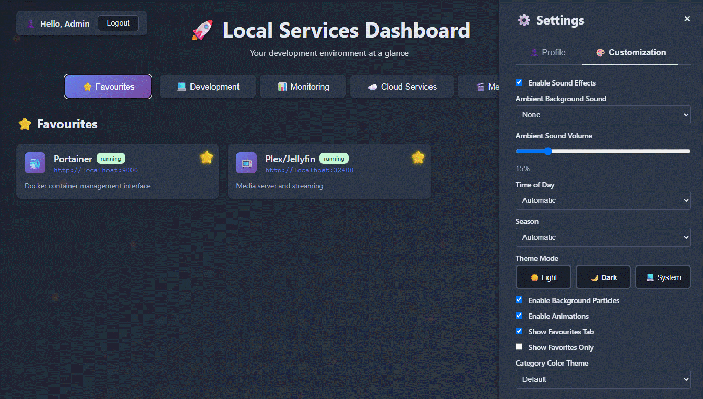

# Start Page - Local Services Dashboard

A beautiful, feature-rich dashboard for managing and accessing your local development services with role-based access control, customizable themes, and immersive ambient sounds.



## ✨ Features

### 🎨 Visual & UX
- **Multi-Theme Support**: Light, Dark, and System themes with 4 color schemes (Default, Vibrant, Pastel, Monochrome)
- **Dynamic Backgrounds**: Time-of-day and seasonal particle animations
- **Ambient Sounds**: Realistic soundscapes (Rain, Ocean, Forest Birds, Coffee Shop, Fireplace)
- **Responsive Design**: Works seamlessly on desktop, tablet, and mobile
- **Customizable Grid**: Choose between 1-4 columns or auto-layout

### 🔐 Security & Access Control
- **User Authentication**: Secure login with bcrypt password hashing
- **Role-Based Access**: Fine-grained permissions per category
- **Admin Panel**: Complete user and role management
- **Localhost Bypass**: Automatic admin access from localhost
- **Session Management**: Long-lived, secure sessions
- **Audit Logging**: Track all administrative actions

### 📊 Service Management
- **Category Organization**: Group services into custom categories
- **Drag & Drop**: Reorder services and categories
- **Status Indicators**: Visual service health status
- **Favorites**: Star services for quick access
- **Search & Filter**: Find services quickly
- **Quick Links**: One-click access to all services

### ⚙️ Configuration
- **Web-Based Config**: No file editing required
- **Systems Management**: Organize categories and services
- **CSV Export**: Generate port mapping files with configurable paths
- **Folder Browser**: Browse and select directories on server with visual navigation
- **CSV Download**: Download generated CSV directly from browser
- **Backup/Restore**: Configuration backup system with configurable paths
- **Live Reload**: Changes apply immediately

### 🎵 Customization
- **Ambient Sounds**: 5 realistic soundscapes with volume control
- **Particle Effects**: Automatic or manual time/season selection
- **Sound Effects**: Interactive UI feedback sounds
- **Emoji Icons**: Beautiful service icons with emoji picker
- **Flexible Layout**: Customize columns and grid appearance

## 🚀 Quick Start

### Prerequisites

- Docker and Docker Compose
- (Optional) Python 3.11+ for local development

### Installation

1. **Clone the repository**:
   ```bash
   git clone https://github.com/makoronius/start-page.git /opt/start-page
   cd /opt/start-page
   ```

2. **Create configuration files**:
   ```bash
   cp config.yaml.example config.yaml
   cp users.yaml.example users.yaml
   ```

3. **Edit configuration**:
   - Edit `config.yaml` with your services
   - Edit `users.yaml` to set passwords (they'll be auto-hashed on first use)

4. **Deploy with Docker**:
   ```bash
   docker compose up -d
   ```

5. **Access the dashboard**:
   - Open `http://localhost` in your browser
   - Login with credentials from `users.yaml`
   - From localhost, you have automatic admin access

## 📁 Project Structure

```
start-page/
├── public/
│   └── index.html              # Single-page application
├── backend/
│   ├── app.py                  # Flask API server
│   ├── auth.py                 # Authentication & authorization
│   └── requirements.txt        # Python dependencies
├── scripts/
│   └── Update-DockerPortProxy.ps1  # Windows port proxy management
├── config.yaml.example         # Sample configuration
├── users.yaml.example          # Sample users & roles
├── docker-compose.yml          # Docker deployment config
├── Dockerfile                  # Container image definition
└── README.md                   # This file
```

## ⚙️ Configuration

### config.yaml

The main configuration file defines settings, categories, and services:

```yaml
settings:
  hostname: localhost
  title: "Local Services Dashboard"
  subtitle: "Your development environment at a glance"
  auto_refresh_minutes: 5
  csv_path: /mnt/c/scripts/port-mappings.csv  # Full path for CSV export
  backup_path: /mnt/c/scripts/backups         # CSV backup directory
  grid_columns: auto  # auto, 1, 2, 3, or 4

categories:
  - name: "Development"
    icon: "💻"
    description: "Development tools"

services:
  - name: "Portainer"
    icon: "🐳"
    url: "http://localhost:9000"
    description: "Docker management"
    port: 9000
    local: true
    status: running
    category: "Development"
```

See `config.yaml.example` for a complete example.

### users.yaml

Defines users, roles, and permissions:

```yaml
users:
  - username: "admin"
    password: "changeme"  # Auto-hashed on first use
    email: "admin@example.com"
    first_name: "Admin"
    last_name: "User"
    roles:
      - "Admins"

roles:
  - name: "Admins"
    description: "Full system access"
    is_admin: true
    categories:
      - "Development"
      - "Monitoring"
```

See `users.yaml.example` for a complete example.

## 🔐 Authentication & Authorization

### User Roles

- **Admins**: Full access to all categories and configuration
- **Custom Roles**: Define roles with specific category access
- **Localhost**: Automatic admin access when browsing from localhost

### Password Security

- Passwords are automatically hashed with bcrypt on first login
- Plain text passwords are migrated to hashed versions automatically
- Password strength requirements enforced for new passwords

### Access Control

Users can only see services in categories assigned to their roles. Admins can:
- Manage all users
- Create and edit roles
- Configure categories and services
- Access all system features

## 🎨 Customization Features

### Themes

**Color Themes**:
- **Default**: Purple gradient
- **Vibrant**: Pink gradient
- **Pastel**: Soft colors
- **Monochrome**: Grayscale

**Mode**: Light, Dark, or System

### Particle Animations

**Two Independent Controls**:

**Time of Day** (affects particle color, intensity and count):
- **Automatic**: Changes based on your local time
- **Morning**: Golden particles, 45 count, 1.2x intensity
- **Afternoon**: Sky blue, 40 count, 1.0x intensity
- **Evening**: Sunset colors, 50 count, 1.3x intensity
- **Night**: Deep purple, 60 count, 1.5x intensity

**Season** (affects visual style and animation):
- **Automatic**: Changes based on current date
- **Summer**: Sun splashes with wave animation
- **Autumn**: Falling leaves
- **Winter**: Gentle snowfall
- **Spring**: Floating sparkles

Both selectors work independently, allowing you to mix and match (e.g., Night + Summer, or Afternoon + Winter).

### Ambient Sounds

**Available Soundscapes**:
- **Gentle Rain**: Soothing rainfall
- **Ocean Waves**: Beach atmosphere
- **Forest Birds**: Realistic chirping with intervals
- **Coffee Shop**: Layered café ambience with steam and clinks
- **Fireplace**: Warm crackling fire

**Features**:
- Volume control slider
- Auto-starts immediately on page load (no click required)
- Persists across sessions
- Realistic multi-layered sound generation using Web Audio API

## 🐳 Docker Deployment

### docker-compose.yml

```yaml
services:
  start-page:
    build: .
    ports:
      - "80:80"
    volumes:
      - ./config.yaml:/app/config.yaml
      - ./users.yaml:/app/users.yaml
      - ./logs:/app/logs
    restart: unless-stopped
```

### Environment Variables

- `SECRET_KEY`: Flask session secret (auto-generated if not set)

### Volumes

- `config.yaml`: Service configuration (persisted)
- `users.yaml`: User accounts and roles (persisted)
- `logs/`: Audit logs (persisted)

## 🔧 Development

### Local Development (without Docker)

1. **Install Python dependencies**:
   ```bash
   cd backend
   pip install -r requirements.txt
   ```

2. **Run the Flask backend**:
   ```bash
   python app.py
   ```

3. **Serve the frontend**:
   ```bash
   cd public
   python -m http.server 8000
   ```

4. **Access**:
   - Frontend: `http://localhost:8000`
   - API: `http://localhost:5555`

### API Endpoints

**Authentication**:
- `POST /api/auth/login` - User login
- `POST /api/auth/logout` - User logout
- `GET /api/auth/me` - Current user info
- `GET /api/auth/profile` - User profile
- `POST /api/auth/profile` - Update profile
- `POST /api/auth/change-password` - Change password

**Configuration**:
- `GET /api/config` - Get configuration
- `POST /api/config` - Update configuration
- `GET /api/csv` - Generate CSV export

**Admin**:
- `GET /api/users` - List all users
- `POST /api/users` - Create user
- `PUT /api/users/<username>` - Update user
- `DELETE /api/users/<username>` - Delete user

## 🎯 Usage Tips

### Adding Services

1. Navigate to **Config > Systems**
2. Add a category (if needed)
3. Click **+ Add New Service** under a category
4. Fill in details and save

### Managing Users

1. Navigate to **Config > Users & Access**
2. Create users and assign roles
3. Define role permissions by category access
4. Edit user profile information (first name, last name, email)

### CSV Export Configuration

The dashboard can generate CSV files for port mapping scripts:

1. Navigate to **Config > Systems** and scroll to **CSV Export**
2. Configure paths:
   - **CSV Path**: Full path including filename (e.g., `/mnt/c/scripts/port-mappings.csv`)
   - **Backup Directory**: Where to store CSV backups (e.g., `/mnt/c/scripts/backups`)
3. Use the **📁 Browse** buttons to navigate and select directories on the server
4. Click **Generate CSV to Server** to create the file on the server
5. Click **📥 Download CSV** to download directly to your browser

The folder browser provides:
- Visual directory navigation
- Parent directory navigation
- Permission checking (locked folders shown but not accessible)
- Refresh functionality
- Path selection with automatic filename preservation

### Favorites

Click the ⭐ icon on any service card to add it to favorites. Access favorites from the dedicated tab.

### Customization

Go to **Settings > Customization**:
- Toggle sound effects
- Choose ambient background sound
- Adjust volume
- Select particle animation mode
- Pick your theme

## 🛠️ Troubleshooting

### Cannot Login

- Check `users.yaml` exists and contains valid users
- Verify password (will be hashed on first login)
- Check browser console for errors

### Services Not Loading

- Verify `config.yaml` is valid YAML
- Check Docker container logs: `docker logs start-page`
- Ensure config file is mounted correctly

### Port Conflicts

```bash
# Check if port 80 is in use
netstat -an | grep :80

# Or change port in docker-compose.yml:
ports:
  - "8080:80"  # Use port 8080 instead
```

### Theme Not Persisting

- Ensure cookies are enabled
- Check browser localStorage is accessible
- Try clearing browser cache

## 📊 Port Proxy Scripts (Windows + WSL2)

### Setup

1. Copy scripts to `C:\Scripts\`:
   ```powershell
   Copy-Item scripts\*.ps1 C:\Scripts\
   Copy-Item scripts\*.csv C:\Scripts\
   ```

2. Run as Administrator:
   ```powershell
   cd C:\Scripts
   .\Update-DockerPortProxy.ps1
   ```

### Features

- Automatic WSL2 IP detection
- Firewall rule creation
- Port proxy management
- CSV-based configuration

## 🚀 Planned Features

The following features are planned for future releases:

### 🎨 Enhanced UI/UX
- **Dashboard Widgets**: Customizable dashboard widgets (system stats, quick links, notes)
- **Unique Color Schemes per Category**: Each category can have its own color theme
- **Custom Service Card Designs**: More card layouts and design options
- **Easter Eggs**: Hidden games and surprises (excludable for professional categories)

### 🔐 Advanced Security
- **Session Token Refresh**: Automatic session invalidation on role/password changes
- **Audit Logging Enhancement**: Track all user launches and session activities
- **IP Whitelisting**: Optional IP-based access control (localhost always allowed for admins)
- **HTTPS/TLS Support**: Optional TLS configuration for secure connections

### 🎯 Productivity Features
- **Advanced Search**: Global search across all services with filters
- **Service Groups**: Create custom service groupings beyond categories
- **Quick Actions**: Keyboard shortcuts and command palette
- **Service Health Monitoring**: Automatic service availability checking

### 🎨 Visual Enhancements
- **More Ambient Sounds**: Additional soundscapes (Thunderstorm, City, Library, etc.)
- **More Particle Effects**: Additional seasonal and time-based animations
- **Custom Backgrounds**: Upload custom background images per category
- **Icon Packs**: Alternative icon sets for services

### 📊 Analytics & Monitoring
- **Usage Analytics**: Track most-used services and access patterns
- **Service Status Dashboard**: Real-time status monitoring for local services
- **Alert System**: Notifications for service downtime or issues
- **Activity Reports**: Generate usage and access reports

Have feature requests? Please [open an issue](https://github.com/makoronius/start-page/issues) on GitHub!

## 🤝 Contributing

Contributions are welcome! Please:

1. Fork the repository
2. Create a feature branch
3. Make your changes
4. Submit a pull request

## 📝 License

MIT License - see LICENSE file for details

## 👤 Author

**Mark Emelianov**
- Email: mark.emelianov@gmail.com
- GitHub: [@makoronius](https://github.com/makoronius)

---

**Built with ❤️ using Claude Code**
